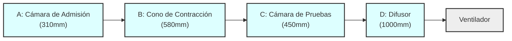
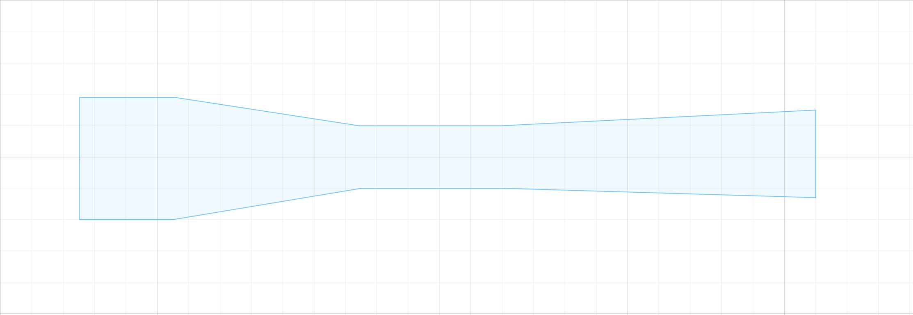

# Diseño y Especificaciones para Túnel de Viento Subsónico 

## 1. Resumen

Especificaciones y dimensiones para la construcción de un túnel de viento subsónico de circuito abierto, diseñado para pruebas experimentales a baja escala. El objetivo principal del diseño es lograr un flujo de aire **uniforme y con baja turbulecia** en la cámara de pruebas.

Las dimensiones se basan en una sección de pruebas objetivo de **150mm x 150mm**.

### Diagrama Conceptual

El siguiente diagrama ilustra el flujo secuencial de los componentes del túnel de viento. La longitud total del ensamblaje es de **2.34 metros** y el aire fluye de izquierda a derecha.

### Geometria General 

## 2. Especificaciones Generales

| Característica         | Especificación                                       |
| ---------------------- | ---------------------------------------------------- |
| **Tipo de Túnel**      | Circuito Abierto, por Succión                        |
| **Régimen de Flujo**   | Subsónico, Incompresible                             |
| **Sección de Pruebas** | **150mm x 150mm**                                    |
| **Relación de Contracción** | **6.76:1** (Excelente para estabilizar el flujo) |
| **Ventilador (Salida)**| **280mm x 280mm** o mayor                           |

## 3. Dimensiones Detalladas por Sección

Dimensiones para cada componente del túnel.

### A. Cámara de Admisión y Asentamiento

*   **Función:** Captar el aire del ambiente de forma suave y estabilizarlo antes de la aceleración. Aquí es donde se deben colocar las **celdas de cerámica** para calentar el aire, idealmente entre mallas estabilizadoras.
*   **Componentes Clave:** Se recomienda instalar al menos una malla tipo panal de abeja o varias mallas de tela finas para reducir las turbulencias del aire entrante y homogeneizar la temperatura.
*   **Especificaciones:**
    *   **Sección Transversal (Entrada):** `390mm x 390mm`
    *   **Longitud:** `310mm`

> **Principio Físico:** El área de esta sección es casi 7 veces mayor que la de la cámara de pruebas. Una gran área de entrada asegura que la velocidad del aire sea muy baja, permitiendo que las mallas sean efectivas para eliminar remolinos sin generar una gran caída de presión.

### B. Cono de Contracción

*   **Función:** Acelerar el flujo de aire de manera uniforme y reducir aún más las variaciones de velocidad y la turbulencia, basándose en el **Principio de Continuidad**.
*   **Forma:** La forma de las paredes debe ser una curva suave y continua. Una **curva polinómica** es teóricamente ideal, pero para la construcción, una curva tangente suave es suficiente para prevenir la separación del flujo, para este ejemplo se utiliza una transicion angular, es pa peor opcion, pero de rapido construcción.
*   **Especificaciones:**
    *   **Sección de Entrada:** `390mm x 390mm`
    *   **Sección de Salida:** `150mm x 150mm`
    *   **Longitud:** `580mm`

> **Advertencia:** Evitar una transición angular o abrupta. Una contracción mal diseñada es la principal fuente de turbulencia en la cámara de pruebas.

### C. Cámara de Pruebas

*   **Función:** Es el core del túnel, donde se coloca la muestra y se realizan las mediciones. El objetivo es tener un flujo con velocidad y presión uniformes en toda su sección.
*   **Especificaciones:**
    *   **Sección Transversal:** `150mm x 150mm`
    *   **Longitud:** `450mm`

> **Principio Físico:** Una longitud de 3 veces el ancho de la sección es una proporción excelente que permite que el flujo se desarrolle y estabilice completamente antes de alcanzar la muestra, que debería colocarse aproximadamente en el centro de esta sección.

### D. Difusor

*   **Función:** Reducir gradualmente la velocidad del aire antes de que llegue al ventilador. Esto recupera presión estática (**Efecto Bernoulli inverso**) y reduce la carga de trabajo del ventilador, permitiéndole operar de manera más eficiente y generar una mayor velocidad de flujo en el túnel.
*   **Especificaciones:**
    *   **Sección de Entrada:** `150mm x 150mm`
    *   **Sección de Salida:** `280mm x 280mm`
    *   **Longitud:** `1000mm (1 metro)`
    *   **Ángulo de Expansión Total:** **~7.4 grados**.

> **Análisis Técnico:** Un ángulo de 7.4 grados está en el límite superior de lo recomendado (idealmente < 7 grados). Es funcional, pero se debe tener especial cuidado en la construcción para que las paredes sean muy lisas y la transición desde la cámara de pruebas sea perfecta, para minimizar el riesgo de separación del flujo.

## 4. Tabla Resumen de Dimensiones

| Sección                    | Dimensiones de Entrada (Ancho x Alto) | Dimensiones de Salida (Ancho x Alto) | Longitud |
| -------------------------- | ------------------------------------- | ------------------------------------ | -------- |
| A: Cámara de Admisión      | 390mm x 390mm                         | 390mm x 390mm                        | 310mm    |
| B: Cono de Contracción     | 390mm x 390mm                         | 150mm x 150mm                        | 580mm    |
| C: Cámara de Pruebas       | 150mm x 150mm                         | 150mm x 150mm                        | 450mm    |
| D: Difusor                 | 150mm x 150mm                         | 280mm x 280mm                        | 1000mm   |
| **TOTAL**                  |                                       |                                      | **2340mm** |

## 5. Materiales y Consideraciones de Construcción

*   **Material:** Se recomienda el uso de materiales lisos y rígidos para las paredes internas, como **MDF, contrachapado (plywood) o acrílico**. También es posible la **impresión 3D** por secciones. La superficie interna debe ser lo más lisa posible para minimizar la capa límite turbulenta.
*   **Sellado:** Todas las juntas entre las secciones deben estar perfectamente selladas para evitar fugas de aire, que reducirían el rendimiento y la uniformidad del flujo. Se puede usar sellador de silicona o cinta adhesiva de alta calidad.
*   **Ventilador:** Dada la gran sección de salida de 280mm x 280mm, un ventilador de PC estándar no será adecuado. Se requerirá un **ventilador axial de mayor tamaño y potencia**, como los utilizados en sistemas de ventilación industrial o de alta gama para gabinetes de servidores, otra opcion menos recomedada es una arreglo de ventiladores 2x2, como el Noctua NF-F12.
*   **Instrumentación:** Dejar previstos los orificios para los termopares y para la inserción de la muestra en la cámara de pruebas. Es recomendable que la parte superior o un lateral de la cámara de pruebas sea desmontable o transparente para facilitar el acceso.

